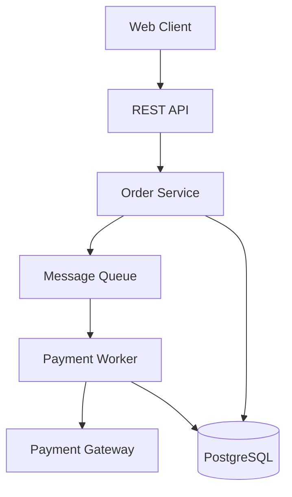

# System Architect - Architecture Consultation

Consult Zartis's expert system architect for architectural design, reviews, and technical decisions.

## What This Does

1. **Reviews architectural proposals** against Zartis best practices
2. **Designs system architecture** for new features or projects
3. **Evaluates technology choices** for scalability and maintainability
4. **Identifies architectural risks** early in the design process
5. **Creates Architecture Decision Records** (ADRs) for significant decisions
6. **Generates architecture diagrams** (Mermaid format)
7. **Validates technical feasibility** of requirements

## When to Use

**Use this command when you need to:**
- Design architecture for a new feature or system
- Review existing architecture for improvements
- Make technology stack decisions
- Evaluate whether to use microservices, caching, messaging, etc.
- Get advice on data model design
- Assess scalability and performance implications
- Validate technical feasibility of requirements
- Create Architecture Decision Records (ADRs)

## Usage

### Design New Architecture
```
/system-architect Design architecture for a real-time notification system that handles 10k notifications per minute
```

### Review Existing Architecture
```
/system-architect Review our current monolith for performance bottlenecks and scalability issues
```

### Technology Decision
```
/system-architect Should we use Redis or PostgreSQL for our caching layer?
```

### Evaluate Architectural Pattern
```
/system-architect Should we break this monolith into microservices for a 3-person team?
```

### Data Model Design
```
/system-architect Design database schema for multi-tenant SaaS application with user permissions
```

### Technical Feasibility
```
/system-architect Is it feasible to support real-time collaboration with 100+ concurrent users?
```

## Output

The system architect will provide:

### 1. Analysis
- Review of current situation or requirements
- Identification of constraints and requirements
- Assessment of scale and complexity

### 2. Recommendation
- Proposed architecture approach
- Technology stack suggestions
- Key design patterns to use
- What to avoid (anti-patterns)

### 3. Architecture Diagrams
Mermaid diagrams showing:
- System components and relationships
- Data flow
- Deployment architecture
- Sequence diagrams for complex workflows

### 4. Architecture Decision Record (if applicable)
Documents significant decisions with:
- Context and problem statement
- Decision and rationale
- Alternatives considered
- Trade-offs and consequences

### 5. Implementation Guidance
- File structure recommendations
- Key interfaces and contracts
- Integration patterns
- Testing strategy
- Deployment considerations

### 6. Risks and Mitigations
- Potential architectural risks
- Performance considerations
- Scalability concerns
- Security implications
- Cost implications

## Example Session

```
User: /system-architect Design architecture for order processing system that handles 1000 orders/hour with payment integration

Architect Response:

📐 Architecture Design: Order Processing System

## Analysis

Requirements:
- Throughput: 1000 orders/hour (~17/min)
- Payment integration (external dependency)
- Need for reliability (financial transactions)
- Current scale: Moderate (no need for over-engineering)

## Recommended Architecture

**Pattern:** Modular Monolith with Message Queue

**Why:**
- Scale doesn't justify microservices complexity
- Need reliability for payment processing
- Want to decouple order creation from payment processing
- Simple deployment and maintenance

**Components:**


**Technology Stack:**
- API: Node.js + Express (or .NET Core based on team)
- Database: PostgreSQL (ACID compliance for orders)
- Message Queue: Azure Service Bus (if Azure) or RabbitMQ
- Payment: Stripe/PayPal SDK

**Key Patterns:**
1. Async processing: Orders created immediately, payments processed async
2. Retry logic: Exponential backoff for payment failures
3. Idempotency: Payment operations safe to retry
4. Status tracking: Order states (pending, paid, failed, refunded)

**Anti-Patterns to Avoid:**
❌ Don't use microservices (overkill for this scale)
❌ Don't process payments synchronously (user waiting)
❌ Don't skip idempotency (double charges)

## Implementation Guidance

**File Structure:**
```
src/
├── api/
│   └── orders/
│       ├── orders.controller.ts
│       ├── orders.service.ts
│       └── orders.validation.ts
├── workers/
│   └── payment-worker.ts
├── services/
│   ├── payment.service.ts
│   └── notification.service.ts
└── db/
    └── models/
        ├── order.model.ts
        └── payment.model.ts
```

## ADR Created

See: docs/architecture/decisions/ADR-001-async-payment-processing.md

## Risks & Mitigations

**Risks:**
1. Payment gateway downtime → Retry queue with exponential backoff
2. Queue overload → Monitor queue depth, scale workers
3. Database bottleneck → Add read replicas if needed (later)

**Performance:**
- Expected latency: <200ms for order creation
- Payment processing: 2-5 seconds (async)
- Database: Single instance sufficient for 1000/hour

**Cost:**
- Infrastructure: ~$200-300/month (Azure/AWS)
- No need for expensive scaling initially

## Next Steps

1. Create ADR for payment processing approach
2. Set up PostgreSQL with proper indexes
3. Configure message queue (Azure Service Bus recommended)
4. Implement order service with status machine
5. Build payment worker with retry logic
6. Add monitoring and alerting

Need help implementing? Use /ship-story with relevant user stories.
```

## Philosophy

The system architect follows Zartis principles:

1. **Customer preference first** - Adapt to client requirements
2. **Start simple, scale smart** - Avoid overengineering
3. **Think 10x growth** - But don't build for it today
4. **Battle-tested tech** - Prefer proven solutions
5. **Pragmatic decisions** - Document trade-offs clearly

## Common Scenarios

### "Should we use microservices?"

**Architect will evaluate:**
- Team size (< 5 people? Probably no)
- Domain complexity (Clear bounded contexts? Maybe)
- Deployment independence needed? (If not, no)
- Recommendation with clear reasoning

### "What database should we use?"

**Architect will consider:**
- Data structure (relational? → PostgreSQL)
- Query patterns (complex joins? → SQL)
- Scale requirements (millions of writes? → Consider sharding)
- Team expertise
- Recommendation: Usually PostgreSQL unless clear reason otherwise

### "How do we handle high traffic?"

**Architect will design:**
- Caching strategy (Redis, CDN)
- Load balancing approach
- Database optimization (indexes, read replicas)
- Async processing (message queues)
- Progressive scaling path (start simple, scale when needed)

## Integration with Other Commands

This command works with:
- `/interview-to-prd` - Reviews PRD for technical feasibility
- `/prd-to-stories` - Validates architecture before story breakdown
- `/ship-story` - Consulted for stories with architectural impact

## Tips

- **Be specific** about requirements (scale, constraints, context)
- **Mention customer** if they have specific architectural preferences
- **Include context** about team size and expertise
- **Ask about trade-offs** - architect will explain pros/cons
- **Request diagrams** - visual representation helps understanding

## Related Commands

- `/interview-to-prd` - Create PRD (includes architecture review)
- `/prd-to-stories` - Break down to stories (with architecture validation)
- `/ship-story` - Implement story (consults architect if needed)

---

**Remember:** Good architecture balances simplicity with scalability. The system architect helps you make pragmatic decisions that serve your customers today while preparing for tomorrow's growth.
