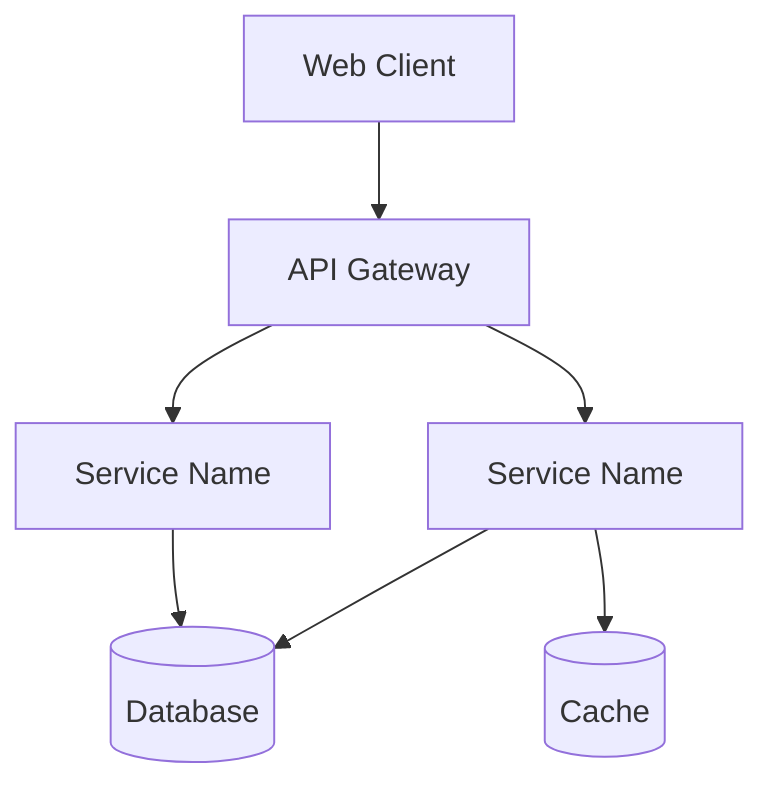

# System Architecture Overview

**Last Updated:** [Date]
**System:** [Project Name]
**Customer:** [Client Name or "Zartis Internal"]

## System Summary

[2-3 sentence overview of what this system does]

## Architecture Style

- [ ] Monolith
- [ ] Modular Monolith
- [ ] Microservices
- [ ] Serverless
- [ ] Hybrid: [Description]

## Technology Stack

### Frontend

- **Framework:** [React/Angular/Vue/etc]
- **Language:** [TypeScript/JavaScript]
- **UI Library:** [Material-UI/Ant Design/etc]
- **Key Libraries:** [List major dependencies]

### Backend

- **Framework:** [Express/NestJS/Spring Boot/.NET/etc]
- **Language:** [Node.js/Java/.NET/Python]
- **API Style:** [REST/GraphQL/gRPC]
- **Key Libraries:** [List major dependencies]

### Data

- **Primary Database:** [PostgreSQL/MongoDB/etc]
- **Caching:** [Redis/None]
- **Message Queue:** [None/RabbitMQ/Kafka/Azure Service Bus/etc]
- **Search:** [None/Elasticsearch/etc]

### Infrastructure

- **Cloud Provider:** [Azure/AWS/GCP]
- **Container Orchestration:** [None/Docker/Kubernetes/Azure Container Apps]
- **CI/CD:** [Azure Pipelines/GitHub Actions/etc]
- **IaC:** [Terraform/ARM/CloudFormation/None]

### Observability

- **Monitoring:** [Application Insights/CloudWatch/Datadog/etc]
- **Logging:** [Structured/Centralized solution]
- **Alerting:** [PagerDuty/Azure Monitor/etc]

## Project Tools

- **Work Management:** [Azure DevOps/GitHub/Jira]
- **Documentation:** [Confluence/ADO Wiki/GitHub Wiki]
- **Communication:** [Slack/Teams]
- **Design:** [Figma/None]

## Key Architectural Decisions

1. **[Decision 1]:** [Brief description] - See [ADR-001](../docs/architecture/decisions/ADR-001-title.md)
2. **[Decision 2]:** [Brief description] - See [ADR-002](../docs/architecture/decisions/ADR-002-title.md)
3. **[Decision 3]:** [Brief description] - See [ADR-003](../docs/architecture/decisions/ADR-003-title.md)

## System Components

[List major components/services/modules]

1. **[Component Name]:** [Purpose and responsibility]
2. **[Component Name]:** [Purpose and responsibility]
3. **[Component Name]:** [Purpose and responsibility]

## Architecture Diagram

## Data Flow

[Brief description of how data flows through the system]

Example:
1. User submits request via web client
2. API Gateway authenticates and routes to appropriate service
3. Service processes request and queries database
4. Results cached for subsequent requests
5. Response returned to client

## Integration Points

[External systems/APIs this system integrates with]

| Integration | Type | Purpose | Documentation |
|-------------|------|---------|---------------|
| Payment Gateway | Stripe API | Process payments | [Link] |
| Email Service | SendGrid | Transactional emails | [Link] |
| Auth Provider | Azure AD | Single sign-on | [Link] |

## Scalability Considerations

[How the system is designed to scale]

**Current Capacity:**
- [Metric 1: e.g., 1000 requests/min]
- [Metric 2: e.g., 10k concurrent users]

**Scaling Strategy:**
- **Horizontal:** [How to scale out]
- **Vertical:** [When to scale up]
- **Database:** [Read replicas, sharding strategy]
- **Caching:** [What's cached, TTL strategy]

**Bottlenecks:**
- [Known bottleneck 1 and mitigation plan]
- [Known bottleneck 2 and mitigation plan]

## Security Considerations

[Key security patterns implemented]

- **Authentication:** [Method: OAuth, JWT, etc]
- **Authorization:** [RBAC, ABAC, etc]
- **Data Encryption:** [At rest, in transit]
- **API Security:** [Rate limiting, input validation]
- **Secrets Management:** [Azure Key Vault, AWS Secrets Manager, etc]
- **Compliance:** [GDPR, HIPAA, SOC2, etc]

## Performance Characteristics

| Metric | Target | Current | Notes |
|--------|--------|---------|-------|
| API Response Time (p95) | < 200ms | [Actual] | [Notes] |
| Database Query Time (p95) | < 50ms | [Actual] | [Notes] |
| Page Load Time | < 2s | [Actual] | [Notes] |
| Throughput | [Target] | [Actual] | [Notes] |

## Deployment Architecture

**Environments:**
- **Development:** [Description]
- **Staging:** [Description]
- **Production:** [Description]

**Deployment Process:**
1. [Step 1]
2. [Step 2]
3. [Step 3]

**Rollback Strategy:** [How to rollback if deployment fails]

## Disaster Recovery

- **Backup Strategy:** [Frequency, retention, location]
- **RTO (Recovery Time Objective):** [Target time to restore]
- **RPO (Recovery Point Objective):** [Maximum data loss acceptable]
- **Failover Strategy:** [Manual/Automatic, process]

## Known Technical Debt

[Major architectural debt items with links to tracking issues]

1. **[Debt Item 1]:** [Description] - [Issue #123]
2. **[Debt Item 2]:** [Description] - [Issue #456]
3. **[Debt Item 3]:** [Description] - [Issue #789]

## Future Roadmap

[Planned architectural improvements]

**Short-term (0-3 months):**
- [Improvement 1]
- [Improvement 2]

**Medium-term (3-6 months):**
- [Improvement 1]
- [Improvement 2]

**Long-term (6+ months):**
- [Improvement 1]
- [Improvement 2]

## Architecture Diagrams

[Links to detailed architecture diagrams]

- **System Context:** [Link to C4 context diagram or Mermaid]
- **Container Diagram:** [Link to component architecture]
- **Sequence Diagrams:** [Link to key flow diagrams]
- **Deployment Diagram:** [Link to infrastructure diagram]

## Related Documentation

- **API Documentation:** [Link]
- **Database Schema:** [Link]
- **Architecture Decision Records:** [docs/architecture/decisions/](../docs/architecture/decisions/)
- **Runbooks:** [Link]
- **Monitoring Dashboards:** [Link]

---

**Maintained by:** [Team/Person Name]
**Review Frequency:** [Monthly/Quarterly]
**Next Review:** [Date]
